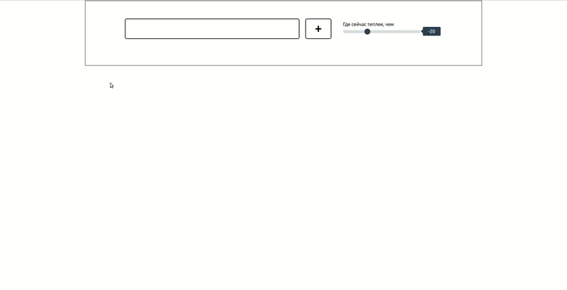

# Mayember

Панель для добавления текущей погоды по городам с сортировкой по температуре.
Тестовое задание для Level.Travel

## Как запустить:
``npm start``

- YOUR_WEATHER_APIKEY заменить на Api key OpenWeather(https://openweathermap.org/)
- YOUR_GOOGLE_APIKEY заменить на  Api key Google(https://console.cloud.google.com/apis)

## MVP функционал:

- Автодополнение при поиске с помощью Api Google
- Добавление найденных городов на панель
- Сортировка городов по температуре
- Удаление городов с панели

## Технологии

**React, Redux, Redux-Saga, API(Google Calendar, OpenWeather).**

## Авторы

- [Александра Волобуева](https://github.com/RabbitWithoutaHat/)
